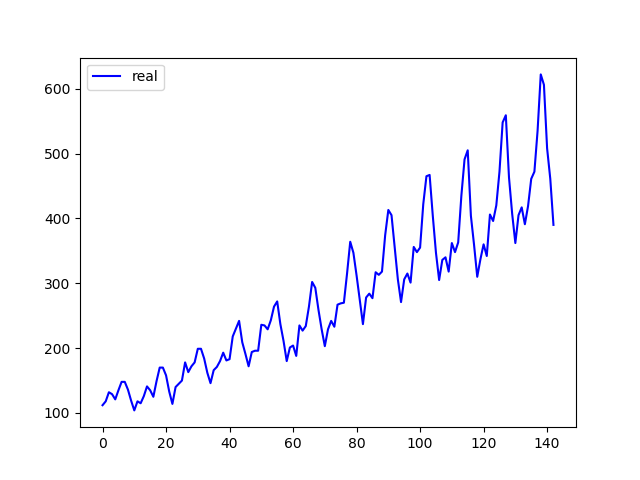
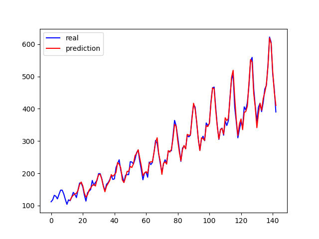

### <center>GRU、LSTM航班预测实验报告</center>

<center>20354034 郭凯</center>
#### 结果统计

|                   网络结构                   |  预测第144月结果  |  LOSS   |
| :------------------------------------------: | :---------------: | :-----: |
|   单层GRU<br />hidden_size=4, num_layer=1    | 445.9325866699219 | 0.00079 |
|   单层LSTM<br />hidden_size=4, num_layer=1   | 438.334228515625  | 0.00080 |
|   二层LSTM<br />hidden_size=4, num_layer=2   |  467.34130859375  | 0.00071 |
|   三层LSTM<br />hidden_size=4, num_layer=3   | 206.1029510498047 | 0.00078 |
| 单层双向LSTM<br />hidden_size=4, num_layer=1 | 460.4250183105469 | 0.00033 |
| 二层双向LSTM<br />hidden_size=4, num_layer=2 | 364.5171813964844 | 0.00020 |
| 三层双向LSTM<br />hidden_size=4, num_layer=3 | 402.020751953125  | 0.00030 |

#### 结果分析



首先从数据集的角度分析，在data.csv文件中，从11月到下一年9月，航班客流量大体呈现上升趋势，而从9月到11月，航班客流量会下降，**每年的第11月到第12月客流量都会上升**。在我们要预测的第144个月，刚好是12月份，而根据以往11年的数据，每年的11月到12月，航班客流量都会上升。因此，我们期望的预测结果应该是大于前一个月，也就是说第144个月的预测结果应该大于第143个月的数据。而第143个月的数据是390，说明我们的预测结果大于390才是符合预期。

从现实生活考虑，该数据取自美国某航空公司的客流量数据，每年12月份刚好是圣诞节，而9~11月是繁忙的工作日，因此12月份旅游人数突增，客流量增大也符合现实生活的经验。

根据上表中的统计数据，我们可以看出单层GRU、单层LSTM、双层LSTM、单层双向LSTM、三层双向LSTM的预测结果可能较好，因为我们期望预测的第144月相比于第143月客流量有一定程度的增长。而三层LSTM、二层双向LSTM的结果可能较差。三层LSTM的预测结果低至206，和我们的预期大相径庭。对于该结果可以解释为，数据较为简单且规模小，而模型较为复杂，导致模型过拟合。当然，模型较好和较差的程度还是得根据真实数据来评判，上面的批判标准是根据以往数据而定的期望决定的。

#### 结果展示

##### 单层GRU



##### LSTM

第一行的3张图片从 左到右分别是 单层LSTM、二层LSTM、三层LSTM

第二行的3张图片从 左到右分别是 单层双向LSTM、二层双向LSTM、三层双向LSTM

<center class="half">
    
    
    
    
    
    
</center>


#### 过程方法

##### 输入维度和特征维度的选取

从图像中我们可以观察到，航班客流量是一个周期性的波动，每隔一段时间上升，每隔一段时间下降。因此，我们的输入维度的选取特别重要。一开始我选取用前两个月份的数据来预测下一个月份，比如：用1、2月的数据预测3月，此时输入的维度为2。但是这样做，**虽然模型的训练误差较小，但是其泛化程度低。**当我使用143个月份的数据来预测第144个月时，模型输出的预测结果基本都在280~390之间，很难超过390，不符合我们的预期。

因此，考虑到数据的周期性波动，我**采用12个月份的数据来预测下一个月**，比如：用去年12月~今年11月的数据来预测今年12月的数据，此时的输入维度为12。这样的预测结果符合预期，正如上面统计表中的结果所示。由于输入维度为12，因此在前12个月份并没有预测结果。

特征维度经过我不断的尝试，发现其对最终结果的影响并不是很大，因此在这里我定义特征维度为4，在保证结果的同时还能一定程度上减小计算量。

输入维度就是代码中的`input_len`变量，特征维度就是代码中的`hidden_size`变量。

##### 防止过拟合的策略

pytorch官方对LSTM类中定义了dropout参数变量，用于防止过拟合。一开始我观察上面的结果图像，发现预测结果和真实值的曲线重合度较高，因此考虑其可能存在过拟合。所以我在模型中加入了dropout函数，以一定概率使LSTM中的神经元失效，最终测试结果下来发现并没有过拟合。

##### 模型训练结果的复现

在训练模型的过程中，我发现每次训练模型得到的输出结果不一样。为了保证每次训练模型得到的结果相同，同时也方面老师和助教对上面的表格数据进行复查，我在代码中设置了随机数种子。只要老师和助教按照上述表格和Readme.txt文件中的说明对代码的相应参数进行修改，就能得到表格中的输出数据。


#### 整个训练模型的流程

##### 1.定义网络结构

 LSTM继承了pytorch官方给的nn.LSTM类，但其中间过程的参数需要自己定义。对于单向和双向LSTM，需要有不同的结构，bidirectional参数表示双向和单向的开关，在定义的时候需要加个if条件判断是否开启双向LSTM，如果开启，在LSTM层转入全连接层时需要将全连接层的输入神经元乘2，因为双向LSTM的输出特征维度为单向的两倍。同时，在LSTM层转入全连接层时我们还需要做相应的数据维度处理，使用view()函数对输入进行拉伸，具体可见代码LSTM.py文件。GRU搭建和单层LSTM相同。

```python
# 单向LSTM结构
class LSTM(nn.Module):
    def __init__(self, input_size=input_len, hidden_size=hidden_size, output_size=output_size, num_layer=num_layer, dropout=0.2, bidirectional=False):
        super(LSTM, self).__init__()
        self.dropout = dropout
        self.bidirectional = bidirectional

        self.layer1 = nn.LSTM(input_size, hidden_size, num_layer, bidirectional=bidirectional)
        if self.bidirectional:
            self.layer2 = nn.Linear(hidden_size * 2, output_size)  # 双向LSTM特征维度要乘2
        else:
            self.layer2 = nn.Linear(hidden_size, output_size)

    def forward(self, x):
        x, _ = self.layer1(x)
        s, b, h = x.size()
        x = x.view(s * b, h)
        x = self.layer2(x)
        x = x.view(s, b, -1)
        return x
```

##### 2.数据预处理

首先对csv文件中的数据进行导入，然后利用MinMaxScaler对导入的数据进行(-1, 1)范围内的归一化。但要注意的是，在最后画图的时候，画出来的图是未归一化的预测结果，因此在训练完模型时还要对输出的结果进行还原。

```python
# 读取数据,取消标题
data = pd.read_csv('./data.csv', usecols=[1], header=None)

# 数据预处理
scaler = MinMaxScaler(feature_range=(-1, 1))
dataset = scaler.fit_transform(data)  # 归一化
dataset = dataset.astype('float32')

'''
训练模型.....
'''

# 将归一化的数据还原
pred = pred.detach().numpy()
pred = pred.reshape(pred.shape[0], -1)
pred = scaler.inverse_transform(pred)
```

##### 3.数据集创建

由于LSTM和GRU是时间序列，用12个月的数据来预测1个月的，因此我们需要将输入和输出分好组，12个输入和1个输出为一组。在代码中，我定义了create_dataset函数用于创建训练数据集，同时我们还需要做相应的数据结构处理，使得创建的数据集能够输入进LSTM和GRU网络：

```python
def create_dataset(dataset, look_back=input_len):
    dataX, dataY = [], []
    for i in range(len(dataset) - look_back):
        a = dataset[i:(i + look_back)]
        dataX.append(a)
        dataY.append(dataset[i + look_back])
    return np.array(dataX), np.array(dataY)

# 创建好输入输出
data_X, data_Y = create_dataset(dataset)
# print(data_X)
train_X = data_X
train_Y = data_Y

# 设置LSTM能识别的数据类型，形成tran_X的一维两个参数的数组，train_Y的一维一个参数的数组
train_X = train_X.reshape(-1, 1, input_len)
train_Y = train_Y.reshape(-1, 1, 1)

# 转化为tensor类型
train_x = torch.from_numpy(train_X)
train_y = torch.from_numpy(train_Y)
```

##### 4.开始训练

将创建好的数据集输入进网络中进行训练，设定epoch=1000，每隔100epoch输出一次LOSS，LOSS采用MSELoss损失，反向传播采用Adam

```python
# 定义损失函数和优化器
criterion = nn.MSELoss()
optimizer = torch.optim.Adam(lstm.parameters(), lr=0.01)

# 开始训练
for epoch in range(1000):
    var_x = Variable(train_x)
    var_y = Variable(train_y)
    # 前向传播
    out = lstm(var_x)
    loss = criterion(out, var_y)
    # 反向传播
    optimizer.zero_grad()
    loss.backward()
    optimizer.step()

    if (epoch + 1) % 100 == 0:  # 每 100 次输出结果
        print('Epoch: {}, Loss: {:.5f}'.format(epoch + 1, loss.item()))

```

##### 5.用训练好的模型预测第144月的结果

我们将第132~143月的数据输入进模型进行144月数据的预测，其数据处理方法与上面一致：

```python
# 选取数据
prex = np.array(dataset[-input_len:])  # 用于预测144月数据的输入
prex = prex.reshape(-1, 1, input_len)
prex = torch.from_numpy(prex)

# 预测144月的结果
prex = prex.reshape(-1, 1, input_len)
prex = Variable(prex)
pred144 = lstm(prex)

# 将归一化的数据还原
pred144 = pred144.detach().numpy()
pred144 = pred144.reshape(pred144.shape[0], -1)
pred144 = scaler.inverse_transform(pred144)
```

##### 6.画图

将模型对各个月的预测结果和真实值画出来，由于是使用12个月的数据来预测1个月，因此前12个月没有预测结果。

```python
# 画图
month = np.arange(143)  # 原始数据从0开始
num = np.arange(input_len, 143)  # 预测结果从第12个月开始
plt.plot(month, data, 'b', label='real')
plt.plot(num, pred, 'r', label='prediction')
plt.legend(loc='best')
plt.show()
```

##### 7.随机种子的设定

由于每次运行代码时网络参数的初始值都是随机设定的，想要复刻实验结果，那需要使得每次网络参数的初始值相同，因此需要设定随机数种子来复现结果：

```python
def setup_seed(seed):
    torch.manual_seed(seed)
    torch.cuda.manual_seed_all(seed)
    np.random.seed(seed)
    random.seed(seed)
    torch.backends.deterministic = True


# 设置随机数种子,使每次运行结果一样
setup_seed(1)
```

